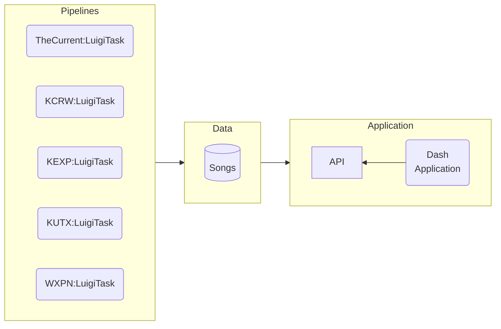

## Overview

Data analysis of music trends based on terrestrial radio station playlists.

## Posts



## Architecture

```mermaid
flowchart LR
    subgraph Pipelines
        direction LR  
        pipeline1(TheCurrent:LuigiTask)
        pipeline2(KCRW:LuigiTask)
        pipeline3(KEXP:LuigiTask)
        pipeline4(KUTX:LuigiTask)
        pipeline5(WFUV:LuigiTask)
        pipeline5(WXPN:LuigiTask)
    end
    subgraph Data
        database[(Songs)]
    end
    subgraph Application
        direction RL 
        API
        web(Dash\n Application)
        web --> API
    end
Pipelines --> Data --> Application


```
